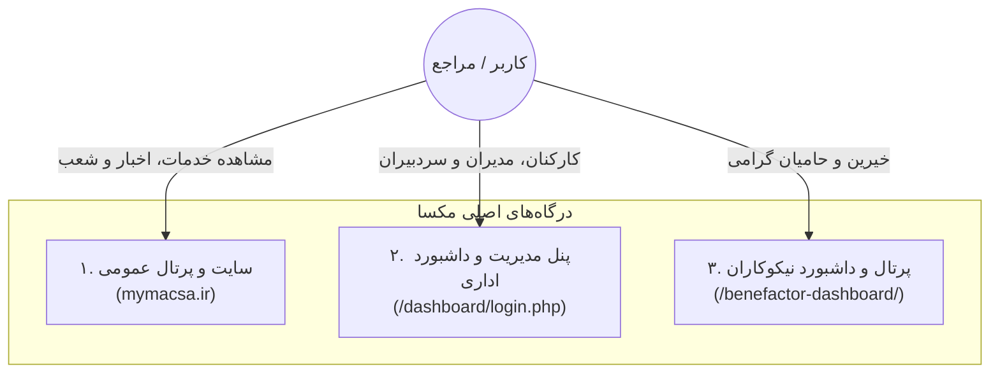

# بخش ۱: مفاهیم پایه و معماری سامانه مکسا

> وضعیت قابلیت: [فعال] فعال و پیاده‌سازی‌شده

---

## ۱. معرفی مأموریت مکسا در سامانه

مؤسسه نیکوکاری کنترل سرطان مکسا (MACSA)، نخستین و جامع‌ترین ارائه دهنده خدمات حمایتی و مراقبت‌های تسکینی (Palliative Care) در ایران به بیماران مبتلا به سرطان و خانواده‌های آنان است. سامانه وب مکسا به گونه‌ای توسعه یافته که نه تنها خدمات متنوع درمانی و مراقبتی را به عموم جامعه و مراجعان معرفی نماید، بلکه سازوکار شفافی برای مشارکت خیرین و مدیریت متمرکز شعب در سراسر کشور فراهم کند.

---

## ۲. سه درگاه مجزای سامانه

سامانه مکسا از سه بخش اصلی با کارکردهای کاملاً متمایز تشکیل شده است:

### درگاه اول: سایت عمومی (Public Website)
* **آدرس اصلی:** دامنه اصلی سایت (مانند `https://mymacsa.ir/` یا روت سرور)
* **مخاطبان:** بیماران، خانواده‌ها، پزشکان و متخصصان، و عموم مردم.
* **کاربرد:** معرفی خدمات رایگان (پزشکی، پرستاری، مشاوره روانشناسی، مددکاری، معنوی، تغذیه، تجهیزات)، معرفی شعب، مطالعه اخبار و مقالات آموزشی، و ارسال درخواست پذیرش بیمار.

### درگاه دوم: پنل مدیریت سامانه (Admin Dashboard)
* **آدرس ورود:** `/dashboard/login.php`
* **مخاطبان:** مدیران ستاد مرکزی، مدیران شعب، مسئولان آموزش، خبرنگاران، مسئولان مالی و اپراتورهای مکسا.
* **کاربرد:** مدیریت چندشعبه‌ای، تولید و تایید اخبار، ساخت صفحات جدید (صفحه‌ساز)، مدیریت کمپین‌های حمایتی، صدور فاکتور و ثبت سفارشات استند تسلیت، مدیریت دوره‌های آموزشی و مشاهده گزارش‌های مالی.

### درگاه سوم: پرتال اختصاصی خیرین (Benefactor Dashboard)
* **آدرس ورود:** `/benefactor-dashboard/`
* **مخاطبان:** خیرین و حامیان مالی نیک‌اندیش.
* **کاربرد:** پنل مدرن تحت وب برای مشاهده تاریخچه تراکنش‌ها، رتبه‌بندی نیکوکاری، ثبت کمک‌های آزاد و کمپینی، سفارش استند و کارت همدلی، و صدور گواهی معافیت مالیاتی.

---

## ۳. معماری چندشعبه‌ای (Multi-Branch Architecture)

یکی از مهم‌ترین ویژگی‌های واقعی پیاده‌سازی شده در این سامانه، **ایزولاسیون چندمستأجری (Tenant Isolation)** برای شعب مختلف است:

1. **دفتر مرکزی (ستاد / HQ):**
 * شعبه ریشه با شناسه `id = 1` و اسلاگ `hq`.
 * دارای اختیارات کلان: تعریف شعبه جدید، دسترسی به تمام ابزارها، نظارت بر تمام تراکنش‌ها و سردبیری اخبار.
2. **شعب استانی و مراکز تابعه (Branches):**
 * هر شعبه دارای نام مستقل (مانند *شعبه بیمارستان امام خمینی (ره)* یا *شعبه تبریز*)، اسلاگ انگلیسی یکتا (مانند `tabriz-branch`)، و مدیر شعبه اختصاصی است.
 * هر شعبه دارای یک صفحه اصلی اختصاصی در مسیر `/{slug}` است.
 * **اصل جداسازی داده‌ها (قانون طلایی):** هر شعبه فقط محتوا، اخبار، دوره‌ها، همکاران، استندها و درآمدهای مالی مربوط به خودش را در داشبورد مشاهده می‌کند و هرگز نمی‌تواند داده‌های سایر شعب را ببیند یا ویرایش کند.

---

## ۴. آدرس‌دهی تمیز (Clean URLs) در سامانه

جهت سهولت استفاده کاربران و ارتقای سئو، آدرس‌های سامانه بدون پسوندهای فنی (نظیر `.php`) عمل می‌کنند:

* صفحه اصلی سایت مرکزی: `/home` یا `/`
* صفحه اختصاصی یک شعبه: `/{branch-slug}` (مثال: `/tabriz-branch`)
* اخبار داخلی یک شعبه: `/{branch-slug}/news/{news-slug}`
* شبکه همکاران یک شعبه: `/{branch-slug}/network`
* صفحات عمومی ساخته‌شده با صفحه‌ساز: `/{slug}` یا `/page/{slug}`
* دانشنامه مکساپدیا: `/macsapedia`
* کاتالوگ دوره‌های آموزشی: `/courses`
* فرم سفارش استند: `/stand-order`
* صفحه تماس با ما: `/contactus`

---

## ۵. اقدامات بعدی شما

برای شروع کار در سامانه:
1. ابتدا با مطالعه [نقش‌ها و دسترسی‌ها (02-roles-and-permissions.md)](02-roles-and-permissions.md)، از نقش خود در سامانه مطلع شوید.
2. سپس به [راهنمای ورود و مدیریت حساب (03-login-and-account.md)](03-login-and-account.md) مراجعه کرده و وارد پنل مدیریت شوید.
