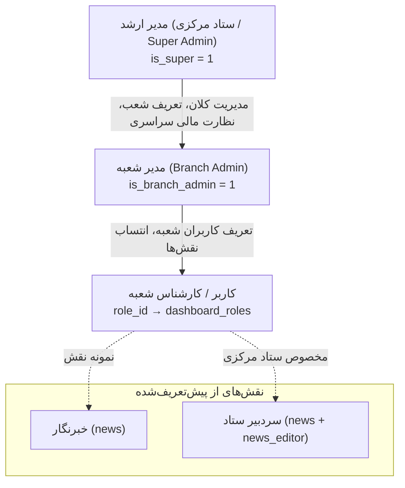

# بخش ۲: نقش‌ها، مسئولیت‌ها و ماتریس دسترسی‌ها

> وضعیت قابلیت: [فعال] فعال و پیاده‌سازی‌شده بر اساس کد و ساختار پایگاه داده

---

## ۱. معرفی نقش‌های کاربری واقعی در سامانه

در سامانه مکسا، به منظور رعایت اصل کمترین سطح دسترسی (Least Privilege) و تفکیک مسئولیت‌ها میان شعب و ستاد، نقش‌ها به صورت دقیق و ساختاریافته در دیتابیس (`dashboard_users` و `dashboard_roles`) تعریف شده‌اند:

---

## ۲. مشخصات و وظایف هر نقش

### ۱. مدیر ارشد سامانه (Super Admin / مدیر مرکزی)
* **شناسه در کد:** `is_super = 1`
* **دامنه دسترسی:** دسترسی کامل و نامحدود به ستاد مرکزی و تمامی شعب.
* **امکانات ویژه:**
 * مشاهده منوی کشویی انتخاب شعبه فعال (Switch Branch) در بالای داشبورد.
 * تعریف شعب جدید، غیرفعال‌سازی یا ویرایش تنظیمات شعب.
 * دسترسی انحصاری به مدیریت «مکساپدیا» و «بانک روایات امید».
 * مشاهده گزارش مالی تلفیقی کل کشور یا تفکیک‌شده به هر شعبه.
 * ساخت و مدیریت کاربران ارشد.

### ۲. مدیر شعبه (Branch Admin)
* **شناسه در کد:** `is_branch_admin = 1`
* **دامنه دسترسی:** صرفاً محدود به شعبه خود.
* **امکانات ویژه:**
 * مدیریت و ساخت کاربران جدید برای همان شعبه (`user-add.php`).
 * تعریف نقش‌های سفارشی برای کارشناسان شعبه.
 * دسترسی به تمام بخش‌های فعال‌شده برای آن شعبه (اخبار، کمپین‌ها، استندها، دوره‌ها و...).
* **محدودیت‌ها:**
 * نمی‌تواند شعبه فعال را عوض کند.
 * به بخش مدیریت شعب یا مکساپدیا دسترسی ندارد.
 * نمی‌تواند کاربر با سطح دسترسی مدیر ارشد بسازد.

### ۳. کاربر / کارشناس شعبه (Branch Operator)
* **شناسه در کد:** کاربر عادی با پیوند به یک نقش (`role_id` در جدول `dashboard_roles`).
* **دامنه دسترسی:** فقط بخش‌هایی از شعبه خود که تیک آن در نقشش فعال شده است.
* **نمونه وظایف:** متصدی ثبت اخبار، کارشناس ثبت استند و سفارشات، متصدی پذیرش بیماران.

### ۴. نقش پیش‌فرض «خبرنگار» (Reporter)
* **دسترسی‌ها:** `["news"]`
* **وظایف:** ورود به بخش اخبار شعبه، درج خبر جدید، بارگذاری تصویر، و ارسال خبر برای سردبیر (تغییر وضعیت به `review`).

### ۵. نقش «سردبیر خبر» (News Editor)
* **شناسه در کد:** دسترسی ویژه `news_editor` (صرفاً در ستاد مرکزی).
* **وظایف:** بررسی خبرهای ارسالی از تمام شعب، ویرایش، انتشار نهایی (`published`) یا رد خبر با ثبت دلیل عدم تایید (`rejected`).

### ۶. نیکوکار / خیر گرامی (Benefactor)
* **شناسه در کد:** کاربر در جدول `panel_users` (پرتال مجزای خیرین).
* **دسترسی:** به داشبورد اداری دسترسی ندارد؛ تنها به پنل شخصی خود در `/benefactor-dashboard/` دسترسی دارد.

---

## ۳. ماتریس دسترسی به بخش‌های مختلف (Permissions Matrix)

در جدول زیر، تمامی بخش‌های واقعی سامانه و قابلیت واگذاری آن‌ها در نقش‌ها آورده شده است:

| شناسه بخش در کد | عنوان فارسی در پنل | مدیر ارشد (HQ) | مدیر شعبه | کاربر با نقش اختصاصی |
| :--- | :--- | :---: | :---: | :---: |
| `hero` | مدیریت هیروها و اسلایدرها | [تأیید] | [تأیید] | بر اساس نقش |
| `news` | مدیریت و درج اخبار | [تأیید] | [تأیید] | بر اساس نقش |
| `campaigns` | مدیریت کمپین‌های حمایتی | [تأیید] | [تأیید] | بر اساس نقش |
| `partners` | شبکه همکاران و پرسنل | [تأیید] | [تأیید] | بر اساس نقش |
| `courses` | آکادمی و دوره‌های آموزشی | [تأیید] | [تأیید] | بر اساس نقش |
| `pages` | صفحه‌ساز و کامپوننت‌ها | [تأیید] | [تأیید] | بر اساس نقش |
| `financial` | گزارش‌های مالی و تراکنش‌ها | [تأیید] (سراسری) | [تأیید] (شعبه خود) | بر اساس نقش |
| `feedback` | انتقادات و پیشنهادات [آزمایشی] | [تأیید] | [تأیید] | بر اساس نقش |
| `medical` | پرونده‌های درمانی و بیماران | [تأیید] | [تأیید] | بر اساس نقش |
| `stands` | استندها و کارتابل سفارشات | [تأیید] | [تأیید] (شعب مجاز) | بر اساس نقش |
| `news_editor` | سردبیری و تایید نهایی خبر | [تأیید] | [عدم دسترسی] | فقط در ستاد مرکزی |
| `maxapedia` | مدیریت دانشنامه مکساپدیا | [تأیید] | [عدم دسترسی] | فقط با تایید مدیر ارشد |
| `branches` | ایجاد و تنظیمات شعب | [تأیید] | [عدم دسترسی] | [عدم دسترسی] |
| `ticketing` | تیکتینگ و مکاتبات داخلی | [تأیید] | [تأیید] | [تأیید] (سطح شعبه) |

---

## ۴. قواعد امنیتی و ایزولاسیون داده‌ها (Tenant Isolation)

1. **قفل بودن شعبه کاربر عادی و مدیر شعبه:** در تمامی فرم‌ها و درخواست‌ها، تابع امنیتی سرور `dash_active_branch_id()` شناسه شعبه را مستقیماً از نشست امن کاربر می‌خواند. تغییر پارامترها در مرورگر تأثیری در تغییر دسترسی کاربر به داده‌های شعب دیگر ندارد.
2. **بررسی دوطرفه (Dual Check):** برای اینکه کاربر به بخشی دسترسی داشته باشد، باید:
 * الف) آن قابلیت برای شعبه او در جدول `branch_features` فعال باشد.
 * ب) آن دسترسی در نقش سازمانی کاربر تیک خورده باشد.
