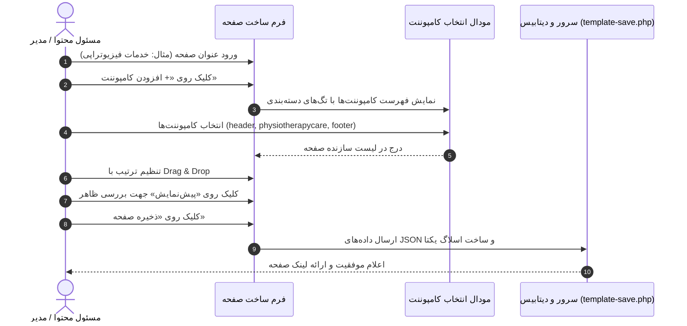

# بخش ۷: راهنمای جامع صفحه‌ساز (Page Builder) و کامپوننت‌های مکسا

> وضعیت قابلیت: [فعال] فعال و پیاده‌سازی‌شده بر اساس `page-list.php`, `template-create.php`, `component-create.php`, `page-view.php`

---

## ۱. فلسفه صفحه‌ساز در سامانه مکسا

سامانه مکسا بر مبنای یک **معماری مبتنی بر کامپوننت (Component-Driven Architecture)** ساخته شده است. این سیستم به مدیران و مسئولان محتوا اجازه می‌دهد تا بدون نیاز به کدنویسی یا تغییر در ساختار سرور، صفحات جدید وب‌سایت (نظیر صفحات معرفی خدمات، همایش‌ها یا صفحات فرود شعب) را صرفاً با چیدمان و ترکیب قطعات آماده (کامپوننت‌ها) ایجاد، ویرایش و منتشر نمایند.

هر صفحه در پایگاه داده (`pages`) دارای:
* یک **عنوان فارسی** (Title)
* یک **اسلاگ یکتای انگلیسی** (Slug) جهت نمایش در آدرس صفحه (مانند `/aboutus`)
* یک فهرست مرتب از **نام کامپوننت‌ها** (JSON)
* یک وضعیت انتشار (`draft`, `published`, `suspended`, `deleted`)
* شناسه شعبه سازنده (`branch_id`)

---

## ۲. راهنمای گام‌به‌گام ساخت یک صفحه جدید

* **آدرس صفحه سازنده:** `/dashboard/template-create.php`

### مراحل اجرایی:
1. وارد پنل مدیریت شده و از منوی سایدبار به بخش **لیست صفحات** بروید و روی دکمه **+ ساخت صفحه جدید** کلیک کنید.
2. در کادر **نام صفحه**، عنوان فارسی مورد نظر را بنویسید (مثال: *معرفی خدمات پرستاری در منزل*).
3. روی دکمه بنفش‌رنگ **+ افزودن کامپوننت** کلیک کنید تا پنجره انتخاب قطعات باز شود.
4. قطعات مورد نیاز صفحه را انتخاب کنید. به عنوان استاندارد، هر صفحه کامل باید شامل موارد زیر باشد:
 * **سربرگ (Header):** کامپوننت `header` یا `topbar` جهت نمایش لوگو، منوی سایت و شماره تماس.
 * **بدنه محتوا:** یک یا چند کامپوننت محتوایی (مانند `nursecare` یا `aboutus`).
 * **پابرگ (Footer):** کامپوننت `footer` جهت نمایش اطلاعات تماس، مجوزها، دسترسی سریع و لینک شبکه‌های اجتماعی.
5. **تغییر چیدمان و ترتیب:** با نگه‌داشتن و کشیدن هر بلوک (Drag & Drop)، ترتیب قرارگیری بخش‌ها در صفحه را به دلخواه جابه‌جا کنید.
6. **حذف یک کامپوننت:** در صورت انتخاب اشتباه، روی دکمه قرمز رنگ **حذف** در کنار همان بلوک کلیک کنید.
7. **پیش‌نمایش (Preview):** پیش از انتشار، روی دکمه آبی‌رنگ **پیش‌نمایش** کلیک کنید تا نحوه نمایش صفحه را بررسی نمایید.
8. **ذخیره نهایی:** روی دکمه سبز رنگ **ذخیره صفحه** کلیک کنید. سامانه به صورت خودکار یک آدرس اینترنتی تمیز (Slug) از روی عنوان تولید کرده و صفحه را در حالت «پیش‌نویس» ذخیره می‌کند.

---

## ۳. مدیریت و انتشار صفحات (Page List)

* **آدرس صفحه:** `/dashboard/page-list.php`

در جدول مدیریت صفحات، امکانات زیر برای هر صفحه در دسترس است:

| ابزار / ستون | عملکرد و نحوه استفاده |
| :--- | :--- |
| **عنوان و Slug** | نام صفحه و آدرس اینترنتی آن در وب‌سایت |
| **لینک صفحه** | پیوند مستقیم برای باز کردن و مشاهده صفحه در تب جدید مرورگر |
| **تغییر زنده وضعیت** | منوی بازشونده با تغییر آنی (بدون نیاز به بارگذاری مجدد صفحه) |
| **ویرایش (`template-create.php?id=...`)** | ویرایش نام یا کم و زیاد کردن کامپوننت‌های صفحه |
| **حذف (`page-delete.php`)** | حذف نرم صفحه همراه با پنجره تأیید امنیتی |
| **مشاهده سابقه (`page-history.php`)** | نمایش تاریخچه ایجاد و تغییرات صفحه در یک پنجره مودال |

### وضعیت‌های چهارگانه صفحه در سامانه:
* [فعال] **منتشر شده (`published`):** صفحه بر روی وب‌سایت زنده است و عموم مراجعان می‌توانند آن را ببینند.
* [آزمایشی] **پیش‌نویس (`draft`):** صفحه ذخیره شده اما فقط برای مدیران قابل مشاهده است و به عموم نشان داده نمی‌شود.
* **در حال تعمیر (`suspended`):** دسترسی موقت به صفحه قطع شده و به مراجعان پیام در حال به‌روزرسانی نمایش داده می‌شود.
* [برنامه‌ریزی‌شده] **حذف شده (`deleted`):** صفحه از لیست صفحات فعال خارج شده است.

---

## ۴. کاتالوگ کامپوننت‌های واقعی سیستم و راهنمای استفاده

سامانه وب مکسا دارای **۴۸ کامپوننت آماده** در مسیر `public_html/dashboard/components/` است. در جدول زیر، مهم‌ترین کامپوننت‌های عملیاتی، کاربرد و نکات تنظیمی هر یک شرح داده شده است:

### دسته اول: کامپوننت‌های ساختاری و چارچوب اصلی
| نام کامپوننت | کاربرد | نوع محتوا و نکات استفاده |
| :--- | :--- | :--- |
| `header` | هدر اصلی سایت مکسا | منوی پیمایش کامل، دکمه ورود/عضویت خیرین، پیوند به پذیرش بیمار و جستجو. باید در ابتدای تمام صفحات قرار گیرد. |
| `topbar` | نوار فوقانی بسیار باریک | نمایش شماره تلفن‌های فوری ۲۴ ساعته مکسا و شعار سازمانی. |
| `footer` | فوتر استاندارد سازمانی | اطلاعات تماس ستاد و شعب، فرم عضویت در خبرنامه، پیوند شبکه‌های اجتماعی و نمادهای اعتماد. |
| `pageheader` | سربرگ داخلی صفحات | نمایش عنوان صفحه به همراه مسیر ناوبری (Breadcrumb). |

### دسته دوم: صفحات خانگی و شعب
| نام کامپوننت | کاربرد | نوع محتوا و نکات استفاده |
| :--- | :--- | :--- |
| `heroindex` | اسلایدر صفحه اصلی ستاد مکسا | اسلایدر بزرگ بنری با تصاویر امیدبخش، عناوین اصلی و دکمه‌های اقدام به عمل (CTA) نظیر «کمک آنلاین» و «درخواست خدمات». |
| `branch-home` | صفحه اصلی اختصاصی شعب | صفحه پویا و هوشمند برای هر مرکز مکسا شامل معرفی همان مرکز، هیرو اختصاصی، آمار خدمات شعبه و آخرین اخبار و کمپین‌های همان شعبه. |
| `branch-partners` | شبکه همکاران شعبه | نمایش اسلایدر پزشکان، پرستاران و پرسنل اختصاصی همان شعبه. |

### دسته سوم: خدمات درمانی و حمایتی (مأموریت اصلی مکسا)
| نام کامپوننت | کاربرد | نوع محتوا و نکات استفاده |
| :--- | :--- | :--- |
| `supportive_and_palliative_care` | معرفی مراقبت‌های تسکینی | توضیح جامع مفهوم مراقبت تسکینی، اهداف و تفاوت آن با درمان‌های رایج. |
| `medicalcare` | خدمات پزشکی تخصصی | معرفی ویزیت پزشکان متخصص طب تسکینی و کنترل درد. |
| `nursecare` | خدمات پرستاری تخصصی | خدمات تعویض پانسمان، زخم بستر، تزریقات و مراقبت در منزل. |
| `physiotherapycare` | فیزیوتراپی و توانبخشی | خدمات توانبخشی حرکتی، لنف‌ادم و بازیابی توان بدنی بیمار. |
| `psychologicalcare` | مشاوره روانشناسی | مشاوره‌های فردی و خانوادگی جهت کاهش اضطراب و پذیرش بیماری. |
| `spritualcare` | مراقبت‌های معنوی | تقویت تاب‌آوری معنوی و آرامش روانی بیماران و بستگان. |
| `nutritioncare` | مشاوره تغذیه بالینی | رژیم‌های اختصاصی برای کاهش عوارض شیمی‌درمانی و بهبود وزن. |
| `socialworkcare` | خدمات مددکاری اجتماعی | حمایت از خانواده‌های کم‌برخوردار و تسهیل امور درمانی و معیشتی. |
| `medicalequipments` | تجهیزات پزشکی امانی | راهنمای دریافت امانی کپسول اکسیژن، تخت بیمارستانی، ویلچر و ساکشن. |
| `patient_intake` | فرم پذیرش بیمار | فرم تعاملی ثبت‌نام و پذیرش بیماران جدید با امکان آپلود مدارک پزشکی. |
| `hamrah` | سامانه ۲۴ ساعته همراه | معرفی خط مشاوره تلفنی شبانه‌روزی بیماران مکسا. |

### دسته چهارم: شفافیت، معرفی ارکان و تاریخچه
| نام کامپوننت | کاربرد | نوع محتوا و نکات استفاده |
| :--- | :--- | :--- |
| `aboutus` | معرفی مکسا و تاریخچه | تاریخچه شکل‌گیری مؤسسه و دستاوردهای چندساله. |
| `mission-vision` | مأموریت و چشم‌انداز | بیانیه ارزش‌ها، چشم‌انداز افق توسعه و منشور اخلاقی مرکز. |
| `association` | اساسنامه مکسا | متن کامل اساسنامه رسمی و اهداف ثبت‌شده در مراجع قانونی. |
| `organizationalchart` | چارت سازمانی | ساختار سازمانی، معاونت‌ها و واحدهای اجرایی. |
| `headdirectors` | شورای عالی مکسا | معرفی اعضای برجسته شورای عالی و حامیان معنوی. |
| `directors` | هیئت مدیره | معرفی مدیرعامل و اعضای محترم هیئت مدیره مکسا. |
| `doctorspage` | کادر درمانی و متخصصان | معرفی پزشکان متخصص طب تسکینی، انکولوژی و هماتولوژی همکار مکسا. |
| `branches` | نقشه و لیست شعب | نقشه تعاملی و فهرست آدرس، تلفن و موقعیت شعب مکسا در سراسر کشور. |

### دسته پنجم: مشارکت‌ها، روایات و اخبار
| نام کامپوننت | کاربرد | نوع محتوا و نکات استفاده |
| :--- | :--- | :--- |
| `onlinedonation` | فرم پرداخت کمک آنلاین | فرم انتخاب مبالغ، روش‌های نذر و ورود به درگاه پرداخت. |
| `stand-order` | سفارش استند و کارت تسلیت | کاتالوگ و فرم آنلاین سفارش استندهای تسلیت و تبریک برای مراسمات. |
| `macsa_stories` | روایات امید مکسا | نمایش خلاصه‌ای از تجارب و داستان‌های واقعی بیماران بهبودیافته. |
| `recent-news-hero-v2` | چیدمان خبر ویژه با هیرو | نمایش خبرهای داغ با تصویر بزرگ شاخص در بالای صفحه. |
| `recent-news-cards-v3` | چیدمان کارتی اخبار | نمایش اخبار اخیر به صورت کارت‌های شبکه‌ای ۳ ستونه. |

---

## ۵. ویرایش پیشرفته و مدیریت محتوای کامپوننت‌ها (ویژه طراحان)

* **آدرس صفحه:** `/dashboard/component-create.php`

چنانچه نیاز باشد کد HTML یا تصاویر داخل یک کامپوننت تغییر کند:
1. وارد صفحه **مدیریت کامپوننت** شوید.
2. با استفاده از جعبه جستجو، نام کامپوننت مورد نظر را بیابید و روی آیکون بازشونده آن کلیک کنید.
3. **پیش‌نمایش زنده:** در سمت چپ، یک کادر شبیه‌ساز (iframe) وجود دارد که ظاهر واقعی کامپوننت را در لحظه نشان می‌دهد.
4. **تغییر تصاویر:** در بخش «تصاویر کامپوننت»، می‌توانید تصویر جدیدی آپلود کنید. تصاویر به صورت خودکار نام‌گذاری شده و با متغیرهایی نظیر `{{image1}}` یا `{{image2}}` در کد قرار می‌گیرند.
5. پس از اعمال تغییرات، روی دکمه **ذخیره** کلیک کنید تا تغییرات در تمامی صفحاتی که از این کامپوننت استفاده می‌کنند اعمال شود.
