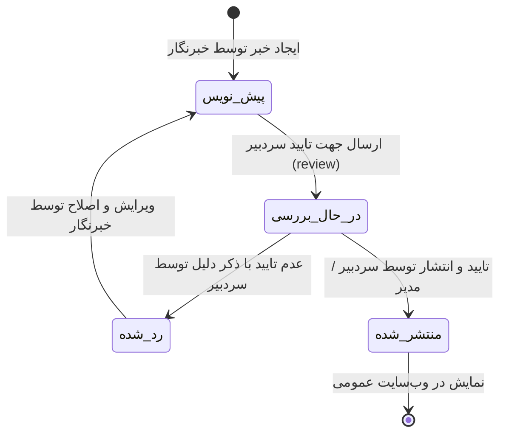

# بخش ۸: راهنمای مدیریت اخبار و فرآیند تحریریه (Editorial Workflow)

> وضعیت قابلیت: [فعال] فعال و پیاده‌سازی‌شده بر اساس `news-create.php`, `news-list.php`, `news-save.php`, `news-status-update.php` و مایگریشن‌های 002، 007، 008

---

## ۱. چرخه حیات و گردش‌کار تحریریه اخبار (Editorial Workflow)

در سامانه مکسا، به منظور حفظ دقت و استانداردهای رسانه‌ای سازمان، انتشار اخبار یک فرآیند کنترل‌شده دو مرحله‌ای میان «خبرنگاران شعب» و «سردبیری ستاد مرکزی» است:

### وضعیت‌های چهارگانه خبر:
1. **پیش‌نویس (`draft`):** خبر اولیه که توسط خبرنگار یا مسئول روابط عمومی شعبه نوشته و ذخیره شده است. فقط برای نویسنده و مدیر شعبه قابل رویت است.
2. **در انتظار بررسی سردبیر (`review`):** خبر توسط نویسنده نهایی شده و جهت ارزیابی در کارتابل تحریریه ستاد مرکزی قرار گرفته است.
3. **منتشر شده (`published`):** خبر توسط سردبیر یا مدیر ارشد تایید گردیده و بلافاصله بر روی پرتال عمومی و صفحه اختصاصی شعبه قرار می‌گیرد.
4. **عدم تایید / نیازمند اصلاح (`rejected`):** خبر توسط سردبیر به همراه توضیح علت رد (`reject_reason`) عودت داده شده است تا خبرنگار آن را بازبینی و اصلاح نماید.

---

## ۲. ایجاد یک خبر جدید (News Create)

* **آدرس صفحه:** `/dashboard/news-create.php`

### فیلدها و ورودی‌های فرم:

1. **عنوان اصلی خبر (Title):**
 * تیتر جذاب و واضح خبر را در این بخش وارد کنید.
 * سامانه دارای شمارنده کاراکتر است تا از طولانی شدن بیش از حد تیتر جلوگیری شود.
2. **زیرعنوان خبر (Subtitle):**
 * چکیده یا سوتیتر یک جمله‌ای که در زیر تیتر اصلی قرار می‌گیرد و به درک سریع پیام خبر کمک می‌کند.
3. **برچسب‌های چندگانه (Tags):**
 * از فهرست تگ‌های موضوعی (نظیر *رویداد*، *طب تسکینی*، *آموزش*، *پیشگیری*، *گزارش تصویری*)، تگ‌های مرتبط را تیک بزنید. امکان انتخاب هم‌زمان چند تگ وجود دارد.
4. **دسته‌بندی خبر (Category):**
 * دسته اصلی خبر (مانند اخبار ستاد، اخبار شعب، همایش‌ها یا اطلاعیه‌ها) را از منوی کشویی انتخاب کنید.
5. **تصویر شاخص خبر (Featured Image):**
 * تصویر اصلی که در سربرگ خبر و در کارت‌های لیست اخبار سایت نمایش داده می‌شود.
 * با کلیک روی کادر بارگذاری یا کشیدن فایل، تصویر با فرمت JPG یا PNG را آپلود نمایید.
6. **ویرایشگر متن خبر (Rich Text Editor):**
 * متن کامل گزارش یا مقاله خبری را در این کادر بنویسید.
 * امکانات ویرایشگر: بولد کردن، تیتربندی (H2, H3)، شماره‌گذاری، نقل‌قول و ایجاد پیوند.
 * **افزودن تصویر در میان متن (Inline Images):** با استفاده از آیکون عکس در نوار ابزار ویرایشگر، می‌توانید در هر کجای متن که لازم است عکس‌های تکمیلی آپلود و درج نمایید.
7. **تاریخ و ساعت انتشار:**
 * می‌توانید تاریخ و زمان انتشار خبر را تعیین کنید.

---

## ۳. ثبت و ارسال خبر

در انتهای فرم، بسته به نقش کاربری شما، دکمه‌های اقدام زیر وجود دارند:

* **دکمه «ذخیره به عنوان پیش‌نویس»:** خبر ذخیره می‌شود تا بعداً بتوانید آن را تکمیل کنید (وضعیت `draft`).
* **دکمه «ارسال جهت بررسی سردبیر»:** خبر در صف ارزیابی تحریریه ستاد مرکزی قرار می‌گیرد (وضعیت `review`).
* **دکمه «انتشار مستقیم» (ویژه سردبیران و مدیران ارشد):** خبر بلافاصله روی سایت منتشر می‌گردد (وضعیت `published`).

---

## ۴. مدیریت و کارتابل اخبار (News List)

* **آدرس صفحه:** `/dashboard/news-list.php`

در صفحه لیست اخبار:
* اخبار بر اساس وضعیت با برچسب‌های رنگی مشخص شده‌اند:
 * [آزمایشی] **در انتظار تایید (Review)**
 * [فعال] **منتشر شده (Published)**
 * **پیش‌نویس (Draft)**
 * [برنامه‌ریزی‌شده] **رد شده (Rejected)**
* **مشاهده آمار بازدید:** تعداد دفعات بازدید مراجعان از هر خبر در ستون بازدیدها ثبت می‌شود.
* **اقدامات سردبیری:** سردبیر ستاد مرکزی با کلیک روی هر خبر در صف، می‌تواند آن را مطالعه کند و:
 * با کلیک روی **تایید و انتشار**، خبر را زنده کند.
 * یا با کلیک روی **عدم تایید** و ثبت یادداشت علت رد (مثلاً *«کیفیت تصویر شاخص پایین است، لطفاً تصویر بهتری جایگزین کنید»*)، خبر را برای خبرنگار عودت دهد.
* **ویرایش و حذف:** امکان ویرایش مجدد خبر یا حذف آن توسط افراد دارای صلاحیت در این جدول فراهم است.

---

## ۵. نحوه نمایش اخبار در سایت عمومی

پس از انتشار، خبر در مسیرهای زیر در دسترس مراجعان خواهد بود:
* در سایت مرکزی: `https://mymacsa.ir/{id}/{slug}`
* در صفحه اختصاصی همان شعبه: `https://mymacsa.ir/{branch-slug}/news/{slug}`
* در بلوک‌های خبری صفحه‌ساز نظیر کامپوننت‌های `recent-news-hero-v2` و `recent-news-cards-v3`.
