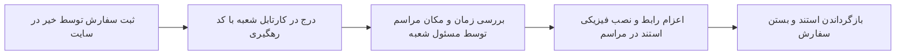

# بخش ۱۰: راهنمای استندهای همدلی، تبریک/تسلیت و کارتابل سفارشات

> وضعیت قابلیت: [فعال] فعال و پیاده‌سازی‌شده بر اساس `stands.php`, `orders.php`, `stand-order.php`

---

## ۱. آشنایی با طرح نمادهای همدلی (استندهای تسلیت و تبریک مکسا)

یکی از روش‌های سنتی و بسیار پرطرفدار مشارکت مردمی در امور خیریه، سفارش استند و تابلوهای یادبود (به جای تاج‌گل‌های طبیعی و تشریفاتی) برای مراسم‌های ترحیم و یادبود یا مجالس تبریک و شادباش است. عواید حاصل از کرایه و اهدای این استندها مستقیماً صرف تأمین هزینه‌های دارو و درمان بیماران مبتلا به سرطان می‌شود.

سامانه مکسا دارای سیستم جامع ثبت و مدیریت سفارشات استند است که فرآیند سفارش اینترنتی توسط نیکوکاران و تحویل و بازگشت فیزیکی استندها توسط شعب را به طور کامل پوشش می‌دهد.

---

## ۲. کاتالوگ و مدیریت استندهای شعبه (Stands Management)

* **آدرس صفحه:** `/dashboard/stands.php`
* **دسترسی:** مدیران شعبی که قابلیت `stands` برای آن‌ها فعال شده است، و مدیر ارشد.

> [!NOTE]
> استندهای فیزیکی به دلیل ملاحظات ترابری و نصب در مساجد و تالارها، به تفکیک شعب تعریف می‌شوند تا هر مرکز استندهای موجود در انبار خود و قیمت‌گذاری محلی را مدیریت نماید.

### ایجاد استند جدید در انبار شعبه:
1. وارد صفحه **مدیریت استندها** شوید.
2. **عنوان استند:** نام یا کد استند را وارد کنید (مثال: *استند طرح شقایق — تسلیت* یا *تابلو رومیزی تبریک طرح نور*).
3. **نوع استند:**
 * **تسلیت و یادبود (`condolence`):** ویژه مراسمات ترحیم و خاکسپاری.
 * **تبریک و شادباش (`congrats`):** ویژه مراسمات افتتاحیه، بازگشت حجاج، جشن‌ها و مناسبت‌ها.
4. **مبلغ اجاره / هدیه (تومان):** مبلغ مصوب شعبه برای هر بار سفارش این استند به تومان (مثال: `۷۵۰۰۰۰`).
5. **تصویر باکیفیت استند:** تصویر واقعی از نمونه کار را آپلود نمایید.
6. **توضیحات و مشخصات:** ابعاد فیزیکی استند، جنس پایه و نحوه چاپ متن اهدایی را بنویسید.
7. **ترتیب نمایش و وضعیت:** اولویت نمایش در سایت و تیک فعال بودن را تنظیم کرده و فرم را ذخیره کنید.

---

## ۳. کارتابل و رهگیری سفارشات استند (Orders Dashboard)

* **آدرس صفحه:** `/dashboard/orders.php`

تمامی سفارشاتی که توسط عموم مراجعان یا نیکوکاران در سایت یا پنل خیرین ثبت می‌شود، بلافاصله در این کارتابل قرار می‌گیرد:

### اطلاعات تفصیلی هر سفارش در جدول:
1. **کد رهگیری یکتا (Tracking Code):** شناسه اختصاصی هر سفارش جهت پیگیری متقاضی.
2. **نوع و تصویر استند:** تصویر کوچک استند انتخابی و نوع آن (تبریک/تسلیت).
3. **مشخصات سفارش‌دهنده (اهداکننده):** نام خیر، شماره تلفن همراه و ایمیل.
4. **مشخصات مکتوب روی استند:**
 * **از طرف:** نام شخص، خانواده یا سازمان اهداکننده.
 * **به یاد / به نام:** نام مرحوم یا شخص تبریک‌گیرنده.
5. **اطلاعات زمان‌بندی و مکان مراسم:**
 * نام مسجد، تالار، آرامستان یا محل برگزاری.
 * آدرس کامل، استان و شهر.
 * تاریخ و ساعت شروع و پایان مراسم جهت اعزام و نصب به موقع توسط کادر ترابری شعبه.
6. **مبلغ و وضعیت پرداخت:** نمایش وجه واریزی و تاییدیه بانکی.

### امکانات فیلتر و جستجو:
* **فیلتر شعبه (ویژه مدیر ارشد):** امکان مشاهده یکجای سفارشات کل کشور یا بررسی کارتابل یک شعبه خاص.
* **جستجوی پیشرفته:** امکان جستجوی سریع بر اساس کد رهگیری، نام سفارش‌دهنده، نام مرحوم یا نشانی محل مراسم.
* **فیلتر مناسبتی:** تفکیک سفارشات تبریک از سفارشات تسلیت.
* **خلاصه آماری بالای صفحه:** نمایش تعداد کل سفارشات دریافت شده و ارزش ریالی کل مبالغ جذب‌شده از این محل.
