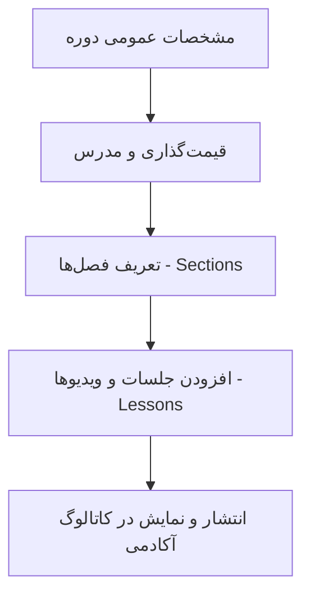

# بخش ۱۱: راهنمای سامانه آموزش و آکادمی مکسا (LMS)

> وضعیت قابلیت: [فعال] فعال و پیاده‌سازی‌شده بر اساس `courses-manage.php`, `courses-create.php`, `course-db.php`, `course-learn.php`, `courses.php`

---

## ۱. آشنایی با آکادمی و سامانه آموزشی مکسا

آموزش و ارتقای دانش عمومی و تخصصی در حوزه طب تسکینی، خودمراقبتی بیماران، تغذیه در دوران شیمی‌درمانی و مهارت‌های مقابله روانی، یکی از ارکان محوری فعالیت‌های مکسا است. سامانه آکادمی مکسا یک سامانه جامع مدیریت یادگیری (LMS) اختصاصی است که امکان ارائه وبینارها، دوره‌های ویدیویی و کارگاه‌های آموزشی را به صورت برخط برای مراجعان، کادر درمانی و خانواده‌های بیماران فراهم می‌سازد.

---

## ۲. کارتابل و مدیریت دوره‌ها (Courses Manage)

* **آدرس صفحه:** `/dashboard/courses-manage.php`
* **دسترسی:** کاربران دارای مجوز `courses` در شعبه، و مدیر ارشد ستاد.

### آمار و شاخص‌های بالای صفحه:
* **کل دوره‌ها:** مجموع کل دوره‌های ثبت‌شده در شعبه.
* **دوره‌های منتشر شده:** دوره‌های فعال و در حال ثبت‌نام در وب‌سایت.
* **دوره‌های پیش‌نویس:** دوره‌های در حال تدوین محتوا.
* **تعداد فراگیران (دانشجویان):** مجموع افراد ثبت‌نام‌شده در دوره‌ها.
* **درآمد حاصله:** جمع مبالغ شهریه دریافتی (در دوره‌های غیررایگان).

### عملیات مدیریتی روی هر دوره:
* **تغییر وضعیت:** امکان تغییر سریع وضعیت بین `منتشر شده` و `پیش‌نویس`.
* **ویرایش دوره:** ویرایش سرفصل‌ها، ویدیوها و مشخصات دوره.
* **حذف دوره:** حذف دوره به همراه سرفصل‌ها و درس‌های ذیل آن (با تأیید امنیتی).

---

## ۳. ایجاد و تدوین دوره جدید (Courses Create)

* **آدرس صفحه:** `/dashboard/courses-create.php`

### ۱) مشخصات عمومی دوره:
* **عنوان دوره:** نام آموزشی دوره (مثال: *دوره جامع مراقبت‌های تسکینی در منزل ویژه خانواده‌ها*).
* **توضیح کوتاه و معرفی:** سرفصل‌های اصلی، پیش‌نیازها و دستاوردهای آموزشی دوره.
* **مدرس / استاد دوره:** نام و عنوان علمی پزشک، پرستار یا روانشناس مدرس دوره.
* **تصویر شاخص (پوستر دوره):** بارگذاری کاور باکیفیت دوره.
* **سطح دوره:** عمومی، مقدماتی، پیشرفته یا تخصصی کادر درمان.

### ۲) قیمت‌گذاری و شهریه:
* **دوره رایگان:** برای دوره‌های عام‌المنفعه و خانواده‌های بیماران، مبلغ روی `۰` تنظیم می‌شود.
* **دوره شهریه‌دار:** تعیین قیمت پایه به تومان و در صورت تمایل تعیین «قیمت با تخفیف».

### ۳) سرفصل‌ها و دروس ویدیویی (Curriculum):
سامانه امکان سازماندهی درختی دوره‌ها را فراهم می‌کند:
1. **افزودن فصل (Section):** گروه‌بندی آموزشی جلسات (مثال: *فصل اول: آشنایی با کنترل درد*).
2. **افزودن جلسه (Lesson):**
 * عنوان درس (مثال: *جلسه اول: مدیریت دردهای عضلانی*).
 * پیوند ویدیو یا پلیر (لینک فایل ویدیویی یا کد امبد آپارات/سرور).
 * مدت زمان جلسه (مثلاً *۱۵ دقیقه*).
 * فایل‌های ضمیمه (در صورت وجود جزوه یا فایل PDF کمکی).
 * **پیش‌نمایش رایگان:** امکان تیک زدن این گزینه برای اینکه مراجعان بتوانند جلسه اول را قبل از ثبت‌نام مشاهده کنند.

---

## ۴. تجربه فراگیران و مسیرهای سایت عمومی (Student Experience)

فراگیران و خانواده‌های بیماران از طریق مسیرهای زیر در وب‌سایت با آکادمی در تعامل هستند:

* **کاتالوگ دوره‌ها (`/courses`):** صفحه نمایش ویترینی دوره‌ها با امکان جستجو و فیلتر موضوعی.
* **صفحه معرفی دوره (`/courses/{id}`):** مشاهده سرفصل‌ها، رزومه مدرس، پیش‌نمایش ویدیویی و دکمه ثبت‌نام.
* **فرآیند ثبت‌نام و تسویه (`/courses/checkout`):** تأیید مشخصات و ثبت‌نام (رایگان یا انتقال به درگاه بانکی).
* **دوره‌های من (`/courses/my`):** میز کار فراگیر شامل دوره‌هایی که در آن‌ها ثبت‌نام کرده است.
* **کلاس درس ویدیویی (`/courses/learn/{id}`):** پلیر اختصاصی پخش ویدیو به همراه فهرست جلسات در کنار تصویر جهت یادگیری گام‌به‌گام.
