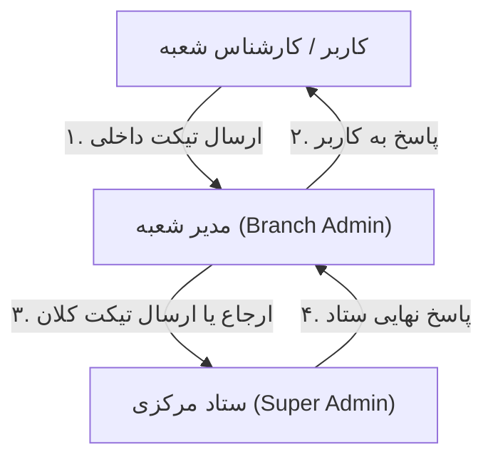

# بخش ۱۵: راهنمای سامانه تیکتینگ و مکاتبات درون‌سازمانی (Ticketing)

> وضعیت قابلیت: [فعال] فعال و پیاده‌سازی‌شده بر اساس `tickets.php` و مایگریشن دیتابیس `002_ticketing.sql`

---

## ۱. هدف از سامانه تیکتینگ در مکسا

برای ایجاد نظم در هماهنگی‌های روزمره اداری و درمانی، پیگیری درخواست‌های پرسنل، درخواست تجهیزات پزشکی یا پشتیبانی فنی، یک سامانه تیکتینگ درختی سه سطحی درون پنل مدیریت مکسا تعبیه شده است. این سیستم جایگزین پیام‌های پراکنده در شبکه‌های اجتماعی شده و سوابق تمامی مکاتبات را به صورت مستند و قابل پیگیری حفظ می‌کند.

---

## ۲. ساختار هرمی و سطوح دسترسی تیکت‌ها

### جریان مکاتبات:
1. **سطح اول — کاربر شعبه به مدیر شعبه (`target = 'branch'`):**
 * کارشناسان هر مرکز (خبرنگار، متصدی استند، متصدی پذیرش) در صورت نیاز به راهنمایی یا گزارش مشکل، تیکت خود را برای مدیر همان شعبه ارسال می‌کنند.
2. **سطح دوم — مدیر شعبه به ستاد مرکزی (`target = 'hq'`):**
 * مدیر شعبه می‌تواند پاسخ کاربر را ثبت کند یا در صورت نیاز به هماهنگی ستادی، همان تیکت را با گزینه «ارجاع به ستاد» به دفتر مرکزی منتقل نماید، یا مستقیماً تیکت جدیدی برای ستاد باز کند.
3. **سطح سوم — پاسخگویی ستاد مرکزی:**
 * کارشناسان و مدیر ارشد در ستاد مرکزی، تیکت‌های دریافتی از شعب سراسر کشور را بررسی کرده و پاسخ می‌دهند.

---

## ۳. ایجاد تیکت جدید (New Ticket)

* **آدرس صفحه:** `/dashboard/tickets.php`

### مراحل ثبت تیکت:
1. وارد صفحه **تیکت‌ها** در پنل مدیریت شوید.
2. روی دکمه **+ تیکت جدید** کلیک کنید.
3. **موضوع تیکت (Subject):** خلاصه عنوان درخواست را بنویسید (مثال: *«درخواست تأمین فوری ۵ عدد کپسول اکسیژن برای شعبه»* یا *«مغایرت در گزارش مالی تراکنش‌های استند»*).
4. **اولویت تیکت (Priority):**
 * [فعال] **عادی (`normal`):** امور روزمره اداری و سوالات عمومی.
 * [آزمایشی] **کم (`low`):** پیشنهادات یا درخواست‌های با مهلت زمانی آزاد.
 * [برنامه‌ریزی‌شده] **فوری (`high`):** موارد اورژانسی مربوط به تأمین تجهیزات بیمار یا مسدود شدن درگاه پرداخت.
5. **متن پیام (Body):** شرح کامل موضوع، جزئیات بیمار یا اسناد مورد نیاز را وارد کنید.
6. روی **ارسال تیکت** کلیک کنید.

---

## ۴. پیگیری، پاسخگویی و وضعیت تیکت‌ها

در جدول کارتابل تیکت‌ها، اطلاعات زیر مشخص است:

| وضعیت | رنگ نشان | مفهوم اجرایی |
| :--- | :---: | :--- |
| **باز (`open`)** | [فعال] | تیکت تازه ثبت شده و در انتظار بررسی و پاسخ مخاطب است. |
| **پاسخ داده شده (`answered`)** | | پاسخ توسط طرف مقابل ثبت شده و نوبت اقدام شماست. |
| **بسته شده (`closed`)** | | موضوع بررسی و حل شده و پرونده تیکت بسته شده است. |

### ارسال پاسخ در نخ گفتگو (Conversation Thread):
* با کلیک روی هر تیکت، تاریخچه کامل پیام‌ها به همراه نام نویسنده، ساعت ارسال و نقش سازمانی وی نمایش می‌یابد.
* در کادر پایین صفحه می‌توانید پیام جدید تایپ کرده و ارسال نمایید.

### ارجاع تیکت به ستاد (Escalate to HQ):
* مدیر شعبه در بررسی تیکت کارشناس خود، در صورتی که تصمیم‌گیری نیاز به مجوز مدیرعامل یا مسئولان ستاد داشته باشد، با کلیک روی دکمه **ارجاع به ستاد**، تیکت را مستقیماً در کارتابل ستاد مرکزی قرار می‌دهد.
