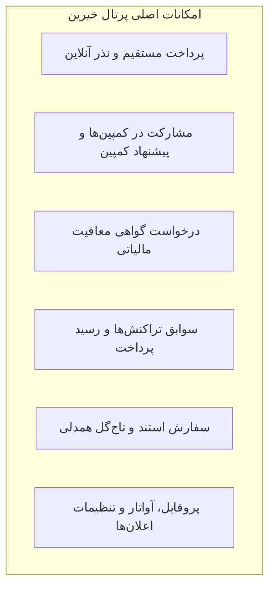

# بخش ۱۸: راهنمای جامع پرتال و داشبورد اختصاصی نیکوکاران (Benefactor Dashboard)

> وضعیت قابلیت: [فعال] فعال و پیاده‌سازی‌شده بر اساس اپلیکیشن React در `public_html/benefactor-dashboard/` و بک‌اند امنیتی `public_html/api/`

---

## ۱. آشنایی با پرتال اختصاصی حامیان و خیرین مکسا

پرتال خیرین مکسا، یک محیط مدرن، امن و ویژه است که به حامیان گرامی امکان می‌دهد تا فرآیند مشارکت‌های خیرخواهانه خود را با شفافیت کامل مدیریت کنند. حامیان می‌توانند بدون واسطه، کمک‌های نقدی خود را پرداخت کرده، روند مصرف کمک‌ها در کمپین‌ها را دنبال کنند، سوابق پرداختی خود را ببینند، برای مراسمات استند سفارش دهند و گواهی رسمی معافیت مالیاتی دریافت نمایند.

* **آدرس اینترنتی پرتال خیرین:** `https://mymacsa.ir/benefactor-dashboard/`

---

## ۲. ثبت‌نام، فعال‌سازی و ورود به حساب

### الف) ایجاد حساب کاربری جدید (Register):
1. به آدرس `/benefactor-dashboard/login` رفته و روی گزینه **«ثبت‌نام جدید»** کلیک کنید.
2. نام، نام‌خانوادگی، شماره تلفن همراه، نشانی ایمیل معتبر و یک رمز عبور امن وارد نمایید.
3. روی دکمه **ثبت‌نام** کلیک کنید.
4. سامانه یک لینک فعال‌سازی به نشانی ایمیل شما ارسال می‌کند. با باز کردن ایمیل و کلیک روی پیوند تأیید، حساب شما فعال می‌شود.

### ب) ورود به حساب کاربری (Login):
1. ایمیل و رمز عبور خود را وارد کرده و دکمه **ورود** را بزنید.
2. نشست شما به صورت امن با فناوری توکن JWT برقرار می‌شود و تا زمان خروج فعال خواهد بود.

### ج) فراموشی رمز عبور (Forgot Password):
* در صورت فراموشی کلمه عبور، روی پیوند **«رمز عبور را فراموش کرده‌اید؟»** کلیک کرده و ایمیل خود را وارد نمایید. لینک بازنشانی رمز بلافاصله برای شما ایمیل خواهد شد.

---

## ۳. پیشخوان اصلی نیکوکار (Dashboard Overview)

پس از ورود، در صفحه نخست پیشخوان، اطلاعات زیر پیش روی شماست:
* **کارت مجموع مبالغ اهدایی:** کل کمک‌های اهدایی شما به تومان از ابتدای عضویت تا کنون.
* **تعداد مشارکت‌ها:** تعداد دفعات واریز موفق به مکسا.
* **نشان و سطح نیکوکاری (Donor Tier):** سامانه‌ای تشویقی که سطح مشارکت حامی را بر اساس میزان حمایت‌ها نمایش می‌دهد (نظیر سطح برنزی، نقره‌ای، طلایی و همراه ویژه).
* **آخرین تراکنش‌ها:** خلاصه ۳ پرداخت اخیر با کد رهگیری بانکی.
* **اعلان‌های جدید:** آخرین پیام‌های مؤسسه درباره وضعیت بیماران یا رویدادها.

---

## ۴. پرداخت مستقیم و کمک نقدی آزاد (Payments)

* **مسیر در پنل:** منوی **کمک مالی مستقیم** (`/benefactor-dashboard/payments`)

### مراحل واریز کمک:
1. مبلغ مورد نظر خود را انتخاب کنید (دکمه‌های آماده: ۱۰۰ هزار تومان، ۵۰۰ هزار تومان، ۱ میلیون تومان، یا تایپ مبلغ دلخواه).
2. نیت یا بابت کمک را مشخص کنید (مانند: *نذر عام درمانی*، *کمک به خرید دارو*، *تجهیزات پزشکی*).
3. روی دکمه **اتصال به درگاه بانکی** کلیک کنید.
4. با ورود به درگاه شاپرک، اطلاعات کارت بانکی خود را وارد کرده و پرداخت را تکمیل کنید.
5. پس از بازگشت به سامانه، رسید دیجیتال شامل **شماره مرجع بانکی (Reference)** و تاریخ دقیق به شما نمایش داده شده و پیامک تأیید ارسال می‌گردد.

---

## ۵. مشارکت در کمپین‌ها و پیشنهاد کمپین (Campaigns)

* **مسیر در پنل:** منوی **کمپین‌های حمایتی** (`/benefactor-dashboard/campaigns`)

### مشارکت در پروژه‌ها:
* مشاهده تمامی کمپین‌های فعال به همراه عکس، مبلغ هدف و درصد پیشرفت.
* کلیک روی گزینه **«حمایت از این کمپین»** و پرداخت وجه؛ مبلغ اهدایی مستقیماً به نوار پیشرفت همان کمپین اضافه می‌شود.

### پیشنهاد کمپین جدید (Suggest a Campaign):
* اگر شما به عنوان یک نیکوکار مایلید پروژه‌ای را برای حمایت از بخش خاصی (مثلاً تأمین تجهیزات یک بیمارستان در منطقه‌ای محروم) به مکسا پیشنهاد دهید:
1. روی دکمه **«پیشنهاد کمپین جدید»** کلیک کنید.
2. عنوان پیشنهادی، برآورد مبلغ مورد نیاز و دلیل اهمیت طرح را بنویسید.
3. درخواست شما مستقیماً در کارتابل مدیران مکسا قرار گرفته و پس از بررسی و تایید، به یک کمپین رسمی تبدیل خواهد شد.

---

## ۶. اثرگذاری کمک‌ها و گواهی معافیت مالیاتی (Impact & Tax)

* **مسیر در پنل:** منوی **اثرگذاری و امور مالیاتی** (`/benefactor-dashboard/impact`)

### الف) گزارش اثرگذاری (Impact Metrics):
سامانه مکسا با فرمول‌های دقیق به شما نشان می‌دهد که مبالغ اهدایی شما معادل چه خدماتی بوده است؛ به عنوان مثال:
* تأمین هزینه‌های مراقبت تسکینی برای ۵ بیمار در منزل
* تأمین ۶۰ دوره داروی مسکن برای بیماران کم‌برخوردار
* تأمین کپسول اکسیژن برای ۳ خانواده

### ب) درخواست گواهی رسمی مالیاتی (ماده ۱۷۲ قانون مالیات‌های مستقیم):
بر اساس قانون مالیات‌های مستقیم جمهوری اسلامی ایران، کمک‌های نقدی اشخاص حقیقی و حقوقی به مؤسسات عام‌المنفعه ثبت‌شده مانند مکسا، به عنوان **هزینه‌های قابل قبول مالیاتی** شناخته شده و از درآمد مشمول مالیات کسر می‌گردد.
1. در بخش مالیاتی، کد ملی (برای اشخاص حقیقی) یا شناسه ملی (برای شرکت‌ها) را وارد نمایید.
2. سال مالیاتی مورد نظر را انتخاب کنید.
3. روی دکمه **«درخواست گواهی مالیاتی»** کلیک کنید.
4. واحد مالی مکسا پس از تطبیق تراکنش‌ها، گواهی رسمی ممهور را برای شما صادر و بارگذاری می‌کند تا به سازمان امور مالیاتی ارائه فرمایید.

---

## ۷. تاریخچه پرداخت‌ها و رسیدها (History)

* **مسیر در پنل:** منوی **تاریخچه پرداخت‌ها** (`/benefactor-dashboard/history`)

* جدول کامل تمامی پرداخت‌های موفق، معلق و لغو شده با تاریخ، ساعت، مبلغ، نام درگاه و شماره پیگیری.
* امکان چاپ یا دانلود نسخه PDF رسید پرداخت معتبر با آرم رسمی خیریه مکسا.

---

## ۸. سفارشات استند و نمادهای همدلی (Orders)

* **مسیر در پنل:** منوی **سفارشات من** (`/benefactor-dashboard/orders`)
* مشاهده لیست و وضعیت استندها و تابلوهای تبریک یا تسلیتی که برای مجالس دوستان و آشنایان سفارش داده‌اید.

---

## ۹. پروفایل کاربری و تنظیمات اعلان‌ها (Profile & Settings)

* **مسیر در پنل:** منوی **پروفایل کاربری** (`/benefactor-dashboard/profile`)
1. **ویرایش مشخصات:** تغییر نام، نام خانوادگی، شماره تماس، کد ملی و آدرس پستی.
2. **تصویر آواتار:** امکان آپلود عکس پروفایل شخصی.
3. **تنظیمات دریافت پیام (Notification Preferences):** فعال یا غیرفعال کردن دریافت پیامک رسید واریز، ایمیل خبرنامه یا گزارش‌های فصلی درمان بیماران.
4. **امنیت و تغییر رمز:** امکان تغییر کلمه عبور حساب در این صفحه فراهم است.
